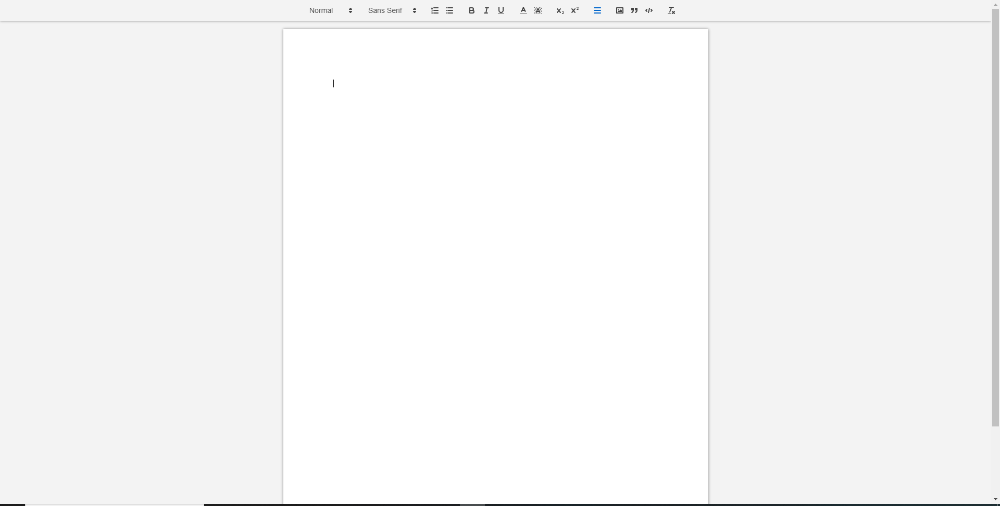
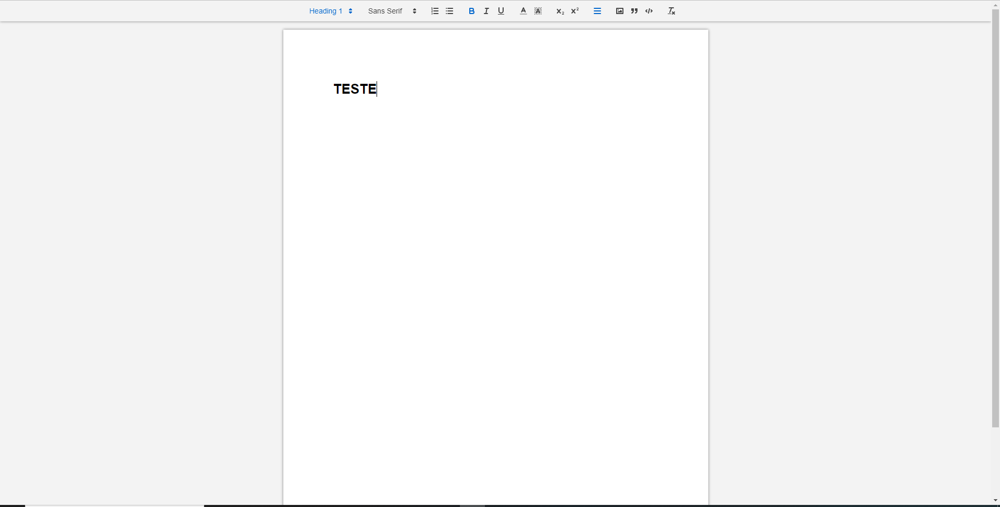

## 💰 Cópia do google docs em React

### Aplicação baseada no google docs que permite você ter acesso a uma área onde você pode escrever qualquer texto e modificar o mesmo,fazer upload de imagens e etc. Uma função muito interessante que desenvolvi é que o sistema é dividido em salas com ids ou seja se um usuário começa um projeto no sistema esse projeto ganha um id e se caso você queira editar esse projeto em tempo real com seu amigo ou parceiro é so colar o id do projeto dele onde está escrito id e dar enter, assim você e seu amigo estarão mexendo no mesmo projetos juntos e em tempo real.

## 🖥️ Algumas Telas Do Projeto

## 💻 Tecnologias Usadas

 

## Instalação 

#### Clone o Projeto Com:  

git clone https://github.com/JoaoRicardo2005/google-docs-copia
#### Entre na pasta e instale as dependências com: 
 Yarn
#### Com tudo correto você pode iniciar o servidor com:
yarn start
#### Se você estiver no ambiente de desenvolvimento, poderá usar o servidor de desenvolvimento:
yarn dev 
yarn queue
## Importante 💛

### a aplicação foi totalmente feita por mim joão ricardo mas você pode usar ela do jeito que preferir! seja para estudo,apoio nos estudos ou até para ganhar dinheiro quem sabe rsrs. entre em contato em joaobarbanti7@gmail.com.

